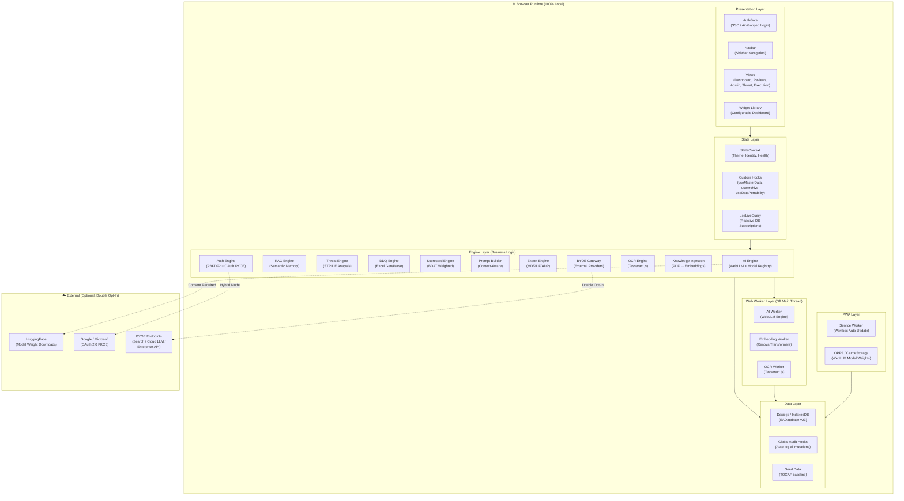
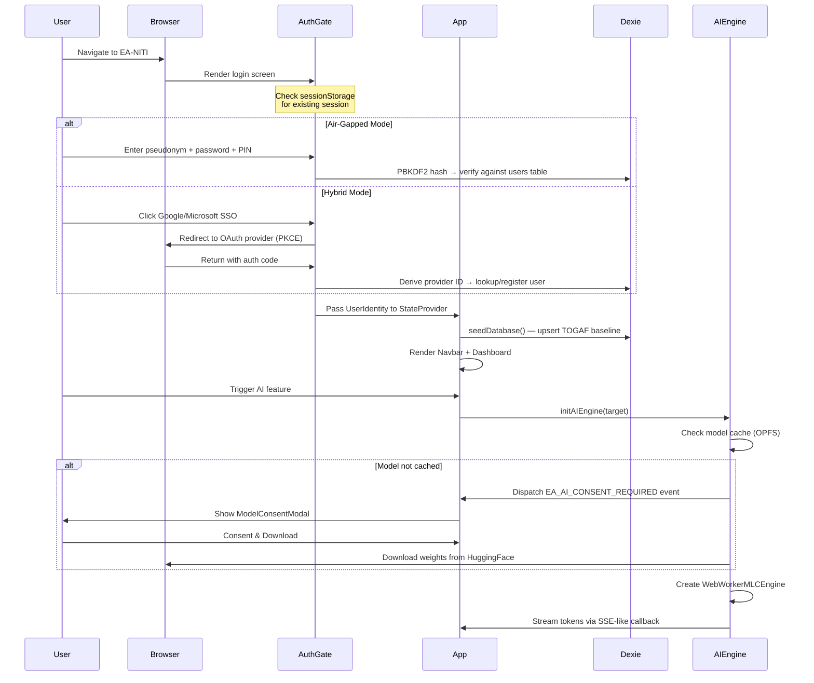
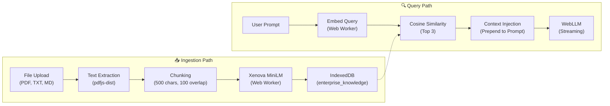

# 🏛️ EA-NITI Edge Agent — System Architecture

> **Version:** 1.0.0 · **Last Updated:** 2026-04-07  
> **Author:** KG-Strategist · **License:** MIT

---

## Table of Contents

1. [Executive Summary](#1-executive-summary)
2. [Design Philosophy & Architectural Pillars](#2-design-philosophy--architectural-pillars)
3. [Technology Stack](#3-technology-stack)
4. [High-Level System Architecture](#4-high-level-system-architecture)
5. [Repository Structure](#5-repository-structure)
6. [Application Lifecycle](#6-application-lifecycle)
7. [Layered Architecture](#7-layered-architecture)
8. [Data Architecture](#8-data-architecture)
9. [AI & Inference Pipeline](#9-ai--inference-pipeline)
10. [Security Architecture](#10-security-architecture)
11. [Component Tree & View Hierarchy](#11-component-tree--view-hierarchy)
12. [Engine Catalog](#12-engine-catalog)
13. [PWA & Offline Strategy](#13-pwa--offline-strategy)
14. [Build & Deployment](#14-build--deployment)
15. [Key Design Patterns](#15-key-design-patterns)
16. [Threat Surface & Mitigations](#16-threat-surface--mitigations)
17. [Future Roadmap](#17-future-roadmap)

---

## 1. Executive Summary

**EA-NITI** (**N**etwork-isolated, **I**n-browser, **T**riage & **I**nference) is an offline-first, air-gapped Progressive Web App (PWA) that accelerates Enterprise Architecture review cycles from weeks to hours. It runs **100% locally in the browser** with zero mandatory cloud dependencies — AI inference, OCR, vector search, document generation, and threat modeling all execute on the user's hardware via WebGPU and Web Workers.

The system is purpose-built for lean EA teams in regulated industries (BFSI, government, defense) where proprietary architecture diagrams **cannot** be uploaded to cloud LLMs. NITI solves this by bringing the LLM to the data, not the data to the LLM.

### Key Capabilities

| Capability | Description |
|---|---|
| **Dynamic Content Metamodel** | TOGAF-aligned, fully customizable EA frameworks (layers, principles, artifacts) |
| **Intelligent DDQ Generator** | Auto-generates Excel Due Diligence Questionnaires with dropdown scoring |
| **BDAT Scorecard Engine** | Weighted vendor comparison across Business, Data, Application, Technology axes |
| **Air-Gapped OCR** | Local Tesseract.js extracts text from architecture diagrams |
| **Dual-Engine WebGPU LLM** | MoE model routing (Core + SME) via `@mlc-ai/web-llm` |
| **Offline Sideloading** | USB/Folder upload directly to OPFS CacheStorage (Sneakernet support) |
| **Enterprise RAG Pipeline** | Semantic search over historical decisions + ingested enterprise knowledge |
| **STRIDE Threat Modeling** | Rule-based + AI-enriched threat analysis with DFD generation |
| **Governance Workflows** | Configurable multi-stage review pipelines (AI + Human approval gates) |
| **Zero-PII Authentication** | PBKDF2-hashed local auth with pseudonymous identities |
| **Full Audit Trail** | Automatic Dexie hooks log every CREATE/UPDATE/DELETE across all tables |

---

## 2. Design Philosophy & Architectural Pillars

```
┌───────────────────────────────────────────────────────────┐
│                    DESIGN MANDATES                        │
├──────────────────┬────────────────────────────────────────┤
│  AIR-GAP FIRST   │ No mandatory network calls. All AI,   │
│                  │ OCR, and storage run locally.          │
├──────────────────┼────────────────────────────────────────┤
│  ZERO-PII        │ No emails, names, or identifiable     │
│                  │ data stored. Pseudonymous identities.  │
├──────────────────┼────────────────────────────────────────┤
│  MINIMAL COMPUTE │ Web Workers for heavy tasks. Lazy      │
│                  │ loading. VRAM-aware model swapping.    │
├──────────────────┼────────────────────────────────────────┤
│  ZERO DEPENDENCY │ Native APIs preferred. No lodash,     │
│  BIAS            │ no heavyweight UI suites.              │
├──────────────────┼────────────────────────────────────────┤
│  DOUBLE OPT-IN   │ Network features require admin toggle │
│  CONSENT         │ AND per-request user consent.          │
└──────────────────┴────────────────────────────────────────┘
```

---

## 3. Technology Stack

### Runtime Dependencies

| Layer | Technology | Purpose |
|---|---|---|
| **UI Framework** | React 19 | Component rendering |
| **Styling** | Tailwind CSS v4 | Utility-first design system |
| **Icons** | Lucide React | Lightweight SVG icon library |
| **Animations** | Motion (Framer) | Micro-animations and transitions |
| **State (Global)** | React Context (`StateContext`) | Theme, identity, system health |
| **State (Reactive DB)** | Dexie React Hooks (`useLiveQuery`) | Real-time IndexedDB subscriptions |
| **Storage** | Dexie.js v4 (IndexedDB) | All persistent data — 23 versioned schema |
| **AI Inference** | `@mlc-ai/web-llm` | WebGPU LLM (Gemma 4 / SmolLM-360M) |
| **Embeddings** | `@xenova/transformers` | `all-MiniLM-L6-v2` embeddings via Web Worker |
| **OCR** | Tesseract.js v7 | Architecture diagram text extraction |
| **PDF Parsing** | pdfjs-dist | Enterprise knowledge ingestion |
| **Spreadsheets** | SheetJS (xlsx) | DDQ Excel generation/parsing |
| **Diagrams** | Mermaid.js v11 | Data flow diagrams, architecture visuals |
| **Markdown** | react-markdown | AI report rendering |
| **Dropdowns** | react-select | Multi-select and creatable inputs |
| **PDF Export** | html2pdf.js | ADR/report export to PDF |

### Build & Dev Dependencies

| Tool | Version | Purpose |
|---|---|---|
| **Vite** | 6.x | Build tool and dev server |
| **TypeScript** | 5.8 | Type safety (ES2022 target) |
| **@vitejs/plugin-react** | 5.x | React Fast Refresh |
| **@tailwindcss/vite** | 4.x | Tailwind v4 integration |
| **vite-plugin-pwa** | 1.x | Workbox-powered PWA generation |
| **tsx** | 4.x | TypeScript execution for scripts |

---

## 4. High-Level System Architecture



---

## 5. Repository Structure

```
EA-Edge-Agent/
├── index.html                    # Vite SPA entry point
├── package.json                  # ea-edge-agent v1.0.0
├── vite.config.ts                # Vite + React + TW v4 + PWA plugin
├── tsconfig.json                 # ES2022, bundler moduleResolution
├── .env.example                  # OAuth Client IDs, Gemini API Key
├── .gitignore / .npmignore / .editorconfig
│
├── public/
│   ├── logo.png                  # EA-NITI branding asset
│   ├── service-worker.js         # Legacy SW (superseded by Workbox)
│   └── models/                   # Placeholder for local model weights
│
├── scripts/
│   └── tiny-model-builder/       # Python scripts for model fine-tuning
│       ├── 1_compile_dataset.py
│       └── 2_finetune_model.py
│
└── src/
    ├── main.tsx                   # React 19 root render (StrictMode)
    ├── App.tsx                    # Router + DB seeder + Auth gate
    ├── index.css                  # Tailwind v4 import + dark variant
    ├── global-types.d.ts          # Vite env types + module declarations
    │
    ├── context/
    │   └── StateContext.tsx        # Global: theme, identity, health, BIAN, tags
    │
    ├── hooks/
    │   ├── useMasterData.ts       # Query active MasterCategory by type
    │   ├── useArchive.ts          # Generic archive/restore/delete logic
    │   ├── useBianDomains.ts      # BIAN domain queries with cascading
    │   └── useDataPortability.ts  # JSON export/import for any table
    │
    ├── views/                     # Page-level components
    │   ├── AuthGate.tsx           # SSO login + air-gapped registration
    │   ├── Dashboard.tsx          # KPI cards, session list, system health
    │   ├── ArchitectureReviews.tsx # Review session list + intake launch
    │   ├── IntakeWizard.tsx       # 3-step intake: Context → DDQ → Artifacts
    │   ├── ReviewExecution.tsx    # AI pipeline: OCR → Init → Generate ADR
    │   ├── ThreatModeling.tsx     # STRIDE threat model list
    │   ├── ThreatEditor.tsx       # Interactive DFD builder + AI enrichment
    │   └── AdminPanel.tsx         # Control panel router (15 sub-tabs)
    │
    ├── components/
    │   ├── Navbar.tsx             # Responsive sidebar + mobile menu
    │   ├── SystemHealth.tsx       # WebGPU / DB / AI status indicators
    │   │
    │   ├── ui/                    # Reusable UI primitives
    │   │   ├── ConfirmModal.tsx   # Destructive action confirmation
    │   │   ├── SafeMermaid.tsx    # Error-safe Mermaid.js renderer
    │   │   ├── StatusToggle.tsx   # Unified 4-state status control
    │   │   ├── StatusSelect.tsx   # Status dropdown wrapper
    │   │   ├── PageInfoTile.tsx   # Collapsible info tile
    │   │   ├── Logo.tsx           # Animated NITI logo + mascot
    │   │   ├── ModelConsentModal.tsx # AI download consent gate
    │   │   ├── AgentChat.tsx      # Floating AI chat assistant
    │   │   ├── AIRewriteButton.tsx # Inline AI text rewrite
    │   │   ├── BDATRadar.tsx      # BDAT radar chart (pure CSS/SVG)
    │   │   ├── CreatableDropdown.tsx # Creatable multi-select
    │   │   └── DataPortabilityButtons.tsx # Export/Import triggers
    │   │
    │   ├── admin/                 # Control Panel tab components (16)
    │   │   ├── LayersTab.tsx          # Architecture layers CRUD
    │   │   ├── PrinciplesTab.tsx      # TOGAF principles CRUD + BYOE trends
    │   │   ├── BianTab.tsx            # BIAN domains CRUD
    │   │   ├── MetamodelTab.tsx       # Content metamodel CRUD
    │   │   ├── CategoriesTab.tsx      # Master categories CRUD + AI gen
    │   │   ├── TagsTab.tsx            # Bespoke tags with color picker
    │   │   ├── PromptsTab.tsx         # AI prompt template CRUD
    │   │   ├── WorkflowTab.tsx        # Governance workflow builder
    │   │   ├── TemplatesTab.tsx       # Report template CRUD
    │   │   ├── NetworkIntegrationTab.tsx # BYOE + privacy settings
    │   │   ├── SystemTab.tsx          # Portability, DB management
    │   │   ├── ModelSandboxTab.tsx     # BYOM model registry
    │   │   ├── UserAccessTab.tsx       # User management
    │   │   ├── AuditWorkspaceTab.tsx   # Audit log viewer
    │   │   ├── DpdpTab.tsx            # DPDP/Privacy compliance
    │   │   └── TrainingEventsTable.tsx # Knowledge ingestion jobs
    │   │
    │   └── widgets/
    │       └── WidgetLibrary.tsx   # Dashboard widget catalog
    │
    └── lib/                       # Pure logic modules (no React)
        ├── db.ts                  # Dexie schema (23 versions, 22 tables)
        ├── db-init.ts             # Legacy DB init
        ├── seedData.ts            # TOGAF baseline + duplicate cleanup
        ├── constants.ts           # MASTER_CATEGORY_TYPES enum
        ├── aiEngine.ts            # WebLLM: init, generate, chat, model routing
        ├── aiWorker.ts            # AI Web Worker entry point
        ├── authEngine.ts          # PBKDF2 auth + OAuth PKCE flows
        ├── oauthConfig.ts         # OAuth 2.0 provider configs + PKCE utils
        ├── ragEngine.ts           # RAG: store/query review + enterprise embeddings
        ├── embeddingWorker.ts     # Xenova MiniLM embedding Web Worker
        ├── promptBuilder.ts       # EA review prompt construction
        ├── threatEngine.ts        # STRIDE analysis + Mermaid DFD generation
        ├── scorecardEngine.ts     # BDAT weighted scorecard computation
        ├── ddqEngine.ts           # DDQ Excel generation/parsing
        ├── ddqRules.ts            # DDQ question bank + filtering rules
        ├── ocrEngine.ts           # Tesseract.js OCR wrapper
        ├── ocrWorker.ts           # OCR Web Worker entry point
        ├── exportEngine.ts        # Markdown/PDF/ADR export
        ├── knowledgeIngestionEngine.ts # PDF/text → embeddings pipeline
        ├── byoeGateway.ts         # BYOE external provider gateway
        └── webWorker.ts           # Tavily web search utility
```

---

## 6. Application Lifecycle



---

## 7. Layered Architecture

The codebase follows a strict 5-layer architecture. Dependencies flow **downward only** — no layer may import from a layer above it.

```
┌─────────────────────────────────────────────────────────┐
│                   PRESENTATION LAYER                     │
│  views/  ·  components/  ·  components/ui/               │
│  React components, pages, and reusable UI primitives.     │
├─────────────────────────────────────────────────────────┤
│                     STATE LAYER                          │
│  context/StateContext  ·  hooks/*  ·  useLiveQuery        │
│  Global state, reactive DB queries, custom hooks.         │
├─────────────────────────────────────────────────────────┤
│                    ENGINE LAYER                           │
│  lib/aiEngine  ·  lib/threatEngine  ·  lib/ddqEngine      │
│  lib/scorecardEngine  ·  lib/ragEngine  ·  lib/authEngine │
│  lib/exportEngine  ·  lib/byoeGateway  ·  lib/oauthConfig │
│  Pure TypeScript modules. No React imports.               │
├─────────────────────────────────────────────────────────┤
│                   WORKER LAYER                           │
│  lib/aiWorker  ·  lib/embeddingWorker  ·  lib/ocrWorker   │
│  Off-main-thread processing. Communicate via postMessage. │
├─────────────────────────────────────────────────────────┤
│                     DATA LAYER                           │
│  lib/db  ·  lib/seedData  ·  lib/constants                │
│  Dexie.js schema, migrations, seed data, type exports.    │
│  IndexedDB, OPFS, CacheStorage, sessionStorage.          │
└─────────────────────────────────────────────────────────┘
```

---

## 8. Data Architecture

> **Development Status: Coded & Active**

### 8.1 Database: `EADatabase` (Dexie.js / IndexedDB)

**Current Schema Version:** 23  
**Total Tables:** 22

#### Architecture & Taxonomy Domain

| Table | Key Indices | Purpose |
|---|---|---|
| `architecture_categories` | `++id, name, type, parentId` | Hierarchical layer categories (tree structure) |
| `architecture_layers` | `++id, name, coreLayer, contextLayer, status` | Architecture layers with BDAT mapping |
| `architecture_principles` | `++id, name, layerId, status` | EA principles linked to layers |
| `content_metamodel` | `++id, name, admPhase, artifactType, status` | TOGAF content metamodel artifacts |
| `master_categories` | `++id, [type+name], type, name, status` | Typed master data (compound index) |
| `bian_domains` | `++id, name, businessArea, businessDomain, status` | BIAN banking domain catalog |
| `bespoke_tags` | `++id, name, category, status` | Custom tags with Tailwind color codes |

#### Review & Workflow Domain

| Table | Key Indices | Purpose |
|---|---|---|
| `review_sessions` | `++id, projectName, type, status, workflowId` | Review sessions with state machine |
| `review_workflows` | `++id, name, triggerReviewType, status, version` | Multi-stage governance workflows |
| `report_templates` | `++id, name, category, status, version` | Markdown report templates |
| `prompt_templates` | `++id, name, category, status, executionTarget, version` | AI prompt templates |
| `threat_models` | `++id, projectName, sessionId, createdAt` | STRIDE threat model records |

#### AI & Knowledge Domain

| Table | Key Indices | Purpose |
|---|---|---|
| `review_embeddings` | `++id, sessionId` | Vector embeddings for review RAG |
| `enterprise_knowledge` | `++id, sourceFile` | Enterprise knowledge embeddings |
| `training_jobs` | `++id, status, startedAt` | Knowledge ingestion job tracking |
| `model_registry` | `++id, name, type, isActive` | BYOM model configurations |

#### Identity & Audit Domain

| Table | Key Indices | Purpose |
|---|---|---|
| `users` | `++id, pseudokey, providerId` | Zero-PII local user accounts |
| `audit_logs` | `++id, timestamp, pseudokey, action, tableName` | Immutable mutation log |
| `global_settings` | `id` | System-wide configuration (SSO mode) |

#### Application Domain

| Table | Key Indices | Purpose |
|---|---|---|
| `app_settings` | `key` | Key-value feature flags |
| `network_integrations` | `++id, providerType, isDefault` | BYOE provider configurations |
| `dashboard_states` | `++id, name, isDefault` | Saved dashboard layouts |

### 8.2 Global Audit Hooks

Every table (except `audit_logs` and `users`) is instrumented with Dexie `creating`, `updating`, and `deleting` hooks. These fire in a separate `ignoreTransaction` context to avoid blocking the primary CRUD operation:

```typescript
// Runs on every mutation across all 20 audited tables
db.audit_logs.add({
  timestamp: new Date(),
  pseudokey: sessionStorage.getItem('ea_niti_session') || 'SYSTEM',
  action: 'CREATE' | 'UPDATE' | 'DELETE',
  tableName: table.name,
  recordId: String(primKey),
});
```

### 8.3 Knowledge Sync & Portability

System Portability includes strict JSON schema validation prior to import and maintains a localized 'Knowledge Sync History' ledger to track all ontology state transfers. This prevents malformed data payloads from corrupting the core architectural taxonomies and provides an immutable audit trail of what was imported or exported.

All history and audit tables across the platform strictly enforce UI parity, supporting localized date-range filtering and zero-network Blob CSV exports.

#### Future Roadmap (v1.1+)
- **Granular Export:** UI to selectively export specific domains/taxonomies rather than the entire NITI Brain.
- **Visual Diff / Conflict Resolution:** A Git-style merge UI to manually resolve JSON payload conflicts against the local Dexie DB prior to committing imports.
- **Cryptographic Integrity:** Hashing/signing exported JSON payloads to detect tampering during air-gapped USB transit.
- **Automated Snapshots & Point-in-Time Rollback:** Automatically capturing a full JSON state backup to Dexie immediately prior to any Knowledge Import, allowing Admins to 1-click "Revert" from the Sync History table.
- **Global Table Component:** Extract table filtering and CSV export into a global, reusable `<EnterpriseDataTable />` component to enforce strict DRY principles.

### 8.4 Schema Migration Strategy

The database uses Dexie's built-in versioned migration system. Key migrations include:

| Version | Change |
|---|---|
| v11 | Rich BIAN domains (businessArea, businessDomain fields) — clears old flat data |
| v12 | Architecture layers gain coreLayer/contextLayer fields |
| v15 | Governance workflows, report templates, multi-vendor DDQ blobs |
| v19 | **Global unified status migration** — converts `isActive: boolean` → `status: enum` across all tables |
| v20 | Zero-PII auth (users, audit_logs, dashboard_states) |
| v22 | BYOM model registry with default Llama-3-8B seed |
| v23 | Global settings table for SSO configuration |

### 8.4 Unified Status Enum

All entity tables use a **4-state lifecycle**:

```
Draft → Active → Needs Review → Deprecated
```

Review sessions use an extended 5-state machine:

```
Draft → Pending → In Progress → Completed / Rejected
```

### 8.5 Global Deletion Policy

All destructive actions utilize our centralized delete utility (`useArchive.ts`). Standard entities are Soft Deleted (Archived) by updating their status to `Deprecated`. RAG entities (such as ingested documents) utilize a "Hybrid-Purge" (Hard Delete vectors + Soft Delete metadata) to prevent LLM ghost-data hallucination while preserving the audit trail of the original ingestion jobs.

All data tables implement a strict UI toggle to view Archived/Purged records, ensuring full visibility of the Soft Delete audit trail. Default system templates (Prompts) utilize on-mount deduplicated seeding to initialize the local Dexie DB.

---

## 9. AI & Inference Pipeline

> **Development Status: Coded & Active**

EA-NITI utilizes a Multi-Agent Swarm architecture. Core routing agents are strictly linked to the inference engine via immutable DB flags. Custom agents are managed in the 'Mitra Registry', supporting JSON portability and OPA policy scaling.

Agent Configurations allow dynamic WebLLM URL targeting with proactive WebGPU availability checks. All Agent Center views are strictly routed and adhere to the global Soft Delete policy.

### 9.1 Dual-Engine Model Architecture

EA-NITI uses a **Mixture of Experts (MoE)** routing strategy with two model slots:

| Slot | Default Model | Role | Temperature |
|---|---|---|---|
| **PRIMARY** (Domain SME) | Gemma 4 (E2B-it-q4f16_1) | Deep domain analysis, ADR gen, pattern review | 0.7 |
| **SECONDARY** (EA Core) | SmolLM-360M-Instruct (q4f16_1) | Quick DDQ audits, STRIDE scans, scorecard validation | 0.2–0.3 |

Models are resolved dynamically from the `model_registry` table via `getDynamicAppConfig()`.

### 9.2 Auto-Route Hybrid

When `executionTarget = 'Auto-Route Hybrid'`:

```typescript
const isCoreEA = /DDQ|scorecard|architecture layer|STRIDE/i.test(prompt);
target = isCoreEA ? 'EA Core Model' : 'Domain SME Model';
```

### 9.3 VRAM Management

The engine enforces a **single-model-in-VRAM** policy. If a different model is requested, the current model is explicitly unloaded before loading the new one:

```typescript
if (engine && currentActiveModelId !== targetModelId) {
    await unloadAIEngine();  // Releases WebGPU resources
}
```

### 9.4 Model Consent Flow

Verified execution path for WebLLM caching: UI Network Check -> Enterprise Consent Modal Render -> Immutable Dexie Audit Log -> Model Download Execution. State hydration and component rendering strictly enforce this sequence.

```
User Triggers AI Feature
    │
    ├── Model cached in OPFS? ──Yes──→ Load & Stream
    │
    └── Model NOT cached
         │
         ├── Network toggle enabled?
         │    ├── Yes → Dispatch EA_AI_CONSENT_REQUIRED event
         │    │         → Show ModelConsentModal
         │    │         → User clicks "Consent & Download"
         │    │         → Download from HuggingFace → Cache to OPFS
         │    │
         │    └── No  → Throw CONSENT_REQUIRED_OFFLINE error
         │              → Instruct user to enable network in settings
```

### 9.5 RAG Pipeline (Retrieval-Augmented Generation)



Two separate knowledge stores are queried in parallel:
1. **Review Embeddings** (`review_embeddings`) — Historical architectural decisions
2. **Enterprise Knowledge** (`enterprise_knowledge`) — Ingested organizational documents

Results are prepended to the prompt as `[PROPRIETARY ENTERPRISE CONTEXT]` and `[ENTERPRISE HISTORICAL CONTEXT]` blocks.

Ingestion history strictly adheres to offline audit standards, featuring zero-network CSV exports and localized date filtering. MVP 1.0 utilizes robust client-side parsing with strict file-type validation (PDF, MD, TXT, CSV, DOCX, Free Text). Legacy binaries are explicitly rejected. The Document Registry supports cascading deletion of semantic chunks for strict data lifecycle management.

#### Future Roadmap (v1.1+)
1. **Advanced EA Parsers**: Direct Archimate XML and TOGAF ingestion.
2. **Granular Chunking Config**: UI controls for semantic chunk size/overlap.

### 9.6 Full Review Execution Pipeline

```
1. OCR Phase
   └── Tesseract.js (Web Worker) extracts text from uploaded architecture diagrams

2. RAG Phase
   ├── findSimilarReviews(prompt) — historical decision context
   └── findRelevantEnterpriseContext(prompt) — enterprise knowledge context

3. Prompt Construction Phase
   └── buildPrompt(reviewType, domain, principles, ocrText, historicalContext)

4. Inference Phase
   ├── Auto-Router selects Core vs. SME model
   ├── Inject RAG context as system-level preamble
   └── Stream tokens to UI as Markdown

5. Post-Processing Phase
   ├── Render Markdown + Mermaid diagrams
   ├── Save reportMarkdown to review_sessions
   └── Generate & store review_embeddings for future RAG
```

### 9.7 Offline Sideloading (Sneakernet)

To support strict air-gapped environments where the browser cannot reach external model hubs, EA-NITI supports **Offline Sideloading**. Users can select a local folder (e.g., from a USB drive) containing raw model weights. The system bypasses all network requests and writes the files directly into the browser's OPFS `CacheStorage` bucket used by WebLLM, registering the model for immediate offline use.

#### Future Roadmap (v1.1+)
1. **WebGPU LoRA Fine-Tuning**: On-device adapter training using telemetry stored in the Distillation Target bins.
2. **Native GGUF Parsing**: Support for single-file model sideloading without directory structures.

### 9.8 Infrastructure vs. Persona Separation

The engine strictly separates **Hardware Infrastructure** (the LLM weight layers and inference APIs) from **Agent Personas** (the semantic guardrails, system prompts, and classification logic). 

**Implementation Details:**
- **Agent Categories (Master Data):** The core routing parameter (e.g. `Tiny Triage`, `MOE`, or `Coding Agent`) defines the cognitive framework, completely abstracted away from whether the model is loaded via WebGPU, Sideload, or Local API.
- **Scaling via OPA Guardrails for 'Coding Agent':** By decoupling the Persona from the Infrastructure, EA-NITI can safely scale into complex Agentic execution environments. For example, a `Coding Agent` persona could route inference to a Local API (like a large Ollama model), but its execution privileges would be dynamically intercepted by upcoming OPA (Open Policy Agent) guardrails, preventing shell breakout or unauthorized local network polling regardless of the underlying LLM's capabilities.

---

## 10. Security Architecture

> **Development Status: Coded & Active**

### 10.1 Zero Data Leakage Model

```
┌──────────────────────────────────────────────────┐
│               BROWSER SANDBOX                     │
│                                                   │
│   ┌─────────┐  ┌──────────┐  ┌────────────┐     │
│   │ WebGPU  │  │ Web      │  │ IndexedDB  │     │
│   │ LLM     │  │ Workers  │  │ (Dexie)    │     │
│   │ Engine  │  │ (OCR/    │  │            │     │
│   │         │  │  Embed)  │  │            │     │
│   └─────────┘  └──────────┘  └────────────┘     │
│                                                   │
│       ❌ No data leaves this boundary              │
│       unless BOTH conditions are met:             │
│       1. Admin enables Network toggle             │
│       2. User consents per-request                │
└──────────────────────────────────────────────────┘
          │                            │
          │ (Double Opt-In Only)       │
          ▼                            ▼
    ┌──────────┐              ┌──────────────┐
    │ Model    │              │ BYOE Gateway │
    │ Weights  │              │ (sanitized   │
    │ Download │              │  query only) │
    └──────────┘              └──────────────┘
```

### 10.2 Authentication

| Mode | Flow |
|---|---|
| **Air-Gapped** | User creates pseudonymous identity → PBKDF2 (100k iterations, SHA-256) hashes password + PIN with random salt → Stored in `users` table → 2FA login (password + PIN) |
| **Hybrid SSO** | OAuth 2.0 Authorization Code with PKCE (no client secret) → Google/Microsoft → Extract only `sub` claim (no PII) → Derive `providerId` → Link to local pseudonym |

### 10.3 Key Security Mechanisms

| Mechanism | Implementation |
|---|---|
| **PBKDF2 Key Derivation** | `window.crypto.subtle.deriveBits()` — 100k iterations, SHA-256 |
| **PKCE Code Challenge** | S256 (`crypto.subtle.digest('SHA-256')`) |
| **CSRF Protection** | Random `state` parameter validated on OAuth callback |
| **PII Stripping** | Only JWT `sub`/`oid` claim extracted — email, name, picture discarded |
| **Query Sanitization** | BYOE gateway strips `<>"'{}\\[]` and truncates to 500 chars |
| **Cross-Origin Isolation** | Vite serves with `Cross-Origin-Embedder-Policy: require-corp` + `Cross-Origin-Opener-Policy: same-origin` |
| **Pseudonymous Identities** | Auto-generated tech-themed pseudonyms (e.g., "Quantum-Nexus-42") |
| **Audit Trail** | Every DB mutation logged with timestamp, pseudokey, action, table. The Audit Workspace supports text search (action/table/user), date-range filtering, and air-gapped CSV log export via the browser Blob API (`URL.createObjectURL`). Zero network calls. |

### 10.4 Identity & Network Air-Gap Strategy

> **Development Status: Tier 1 Coded & Active (MVP 1.0)**

EA-NITI supports a **3-tier identity model** designed for progressive enterprise adoption:

| Tier | Mode | Technology | Status |
|---|---|---|---|
| **Tier 1** | Standalone Air-Gap | Local Pseudonyms via Dexie (PBKDF2 + 2FA PIN) | ✅ Active (v1.0) |
| **Tier 2** | Intranet Air-Gap | On-Premise AD / LDAP binding | ⏳ Planned (v1.1) |
| **Tier 3** | Hybrid Cloud | External SSO via OIDC / SAML 2.0 | ⏳ Planned (v1.2) |

**Tier 1 (MVP 1.0)** — Zero-backend deployment. Users create pseudonymous local identities with PBKDF2-hashed passwords and 2FA PIN verification. All credentials are stored exclusively in IndexedDB. No network connectivity is required.

**Tier 2 (v1.1)** — Enterprise intranet deployment. The forthcoming **Edge Proxy** module will run as a lightweight sidecar process that handles LDAP bind operations and translates AD group memberships into local RBAC roles without exposing raw LDAP traffic to the browser. The PWA communicates with the proxy over `localhost` only.

**Tier 3 (v1.2)** — Hybrid cloud deployment. The Edge Proxy module extends to handle OIDC/SAML 2.0 token exchange (Authorization Code + PKCE) with external identity providers. Only the non-PII `sub` claim is extracted and linked to a local pseudonym. The browser PWA never directly contacts the external IdP — all token flows are proxied through the local Edge Proxy to avoid violating browser CORS and air-gap constraints.

### 10.5 Contextual Privacy Guardrails (DPDP/GDPR)

> **Development Status: Coded & Active (v24)**

For MVP 1.0, privacy compliance is enforced at the **inference layer** via dynamic rule injection rather than an external policy engine (e.g., OPA). This keeps the system 100% air-gapped while maintaining configurable compliance.

**Architecture:**

```
┌──────────────────────────────────────────────────┐
│  Dexie → privacy_guardrails table                │
│  ┌────────────────────────────────────────────┐  │
│  │ id | title                  | isActive     │  │
│  │  1 │ Strict PII Anonymize  │ ✅            │  │
│  │  2 │ Data Localization     │ ✅            │  │
│  │  3 │ (Custom User Policy)  │ ✅ / ❌       │  │
│  └────────────────────────────────────────────┘  │
│                    │                              │
│                    ▼                              │
│  getSystemPrompt() appends:                      │
│  [PRIVACY GUARDRAILS — STRICT COMPLIANCE]        │
│  1. [Strict PII Anonymization]: ...              │
│  2. [Data Localization (DPDP)]: ...              │
│  [END PRIVACY GUARDRAILS]                        │
│                    │                              │
│                    ▼                              │
│  WebLLM / BYOM system prompt injection           │
└──────────────────────────────────────────────────┘
```

**Key Design Decisions:**
- **Default Guardrails** are seeded during DB initialization and cannot be deleted (only toggled active/inactive).
- **Custom Guardrails** can be created, toggled, and deleted by Lead EA administrators.
- The guardrails block is fetched on **every** `getSystemPrompt()` call (both `chatWithAgent` and `generateReview`), ensuring no stale policy state.
- No external policy engine dependency — rules are simple text constraints that shape the LLM's behavior boundary.

---

## 11. Component Tree & View Hierarchy

### 11.1 Routing Model

The application uses **state-based routing** via `useState` in `App.tsx` — no React Router:

```typescript
const [currentView, setCurrentView] = useState('dashboard');
//  dashboard | reviews | threat | expert-config |
//  agent-config | system-pref | knowledge-mgmt
```

### 11.2 View Map

```
App.tsx
├── AuthGate (unauthenticated)
│   ├── Mode Selection (Hybrid / Air-Gapped)
│   ├── SSO Login (Google / Microsoft)
│   ├── Local Registration (pseudonym + password + PIN)
│   └── Local Login (2FA)
│
└── AppContent (authenticated)
    ├── Navbar (sidebar)
    ├── Header (breadcrumbs + logout)
    ├── ModelConsentModal (global)
    ├── AgentChat (floating)
    │
    ├── Dashboard
    │   ├── KPI Cards (sessions, pending, principles, domains)
    │   ├── SystemHealth panel
    │   └── Recent Sessions list
    │
    ├── ArchitectureReviews
    │   ├── Session list (filterable)
    │   └── IntakeWizard (3-step)
    │       ├── Step 1: Context (project name, type, domain, tags)
    │       ├── Step 2: DDQ (generate/upload Excel)
    │       └── Step 3: Artifacts (upload architecture diagrams)
    │
    ├── ReviewExecution
    │   ├── Phase 1: OCR extraction
    │   ├── Phase 2: AI initialization + consent
    │   ├── Phase 3: Report generation (streaming Markdown)
    │   ├── Phase 4: BDAT Scorecard
    │   └── Phase 5: ADR export (MD/PDF)
    │
    ├── ThreatModeling
    │   ├── ThreatModeling (list view)
    │   └── ThreatEditor
    │       ├── Component builder (DFD)
    │       ├── Auto-STRIDE analysis
    │       ├── Mermaid DFD preview
    │       └── AI enrichment
    │
    └── AdminPanel (15 sub-tabs in 4 groups)
        ├── Architecture Setup
        │   ├── LayersTab
        │   ├── PrinciplesTab
        │   └── BianTab
        ├── Taxonomy & Metadata
        │   ├── MetamodelTab
        │   ├── CategoriesTab
        │   └── TagsTab
        ├── Agent Behaviors
        │   ├── PromptsTab
        │   ├── WorkflowTab
        │   └── TemplatesTab
        └── System Preferences / Security
            ├── NetworkIntegrationTab
            ├── SystemTab (+ ModelSandboxTab)
            ├── UserAccessTab
            ├── AuditWorkspaceTab
            └── DpdpTab
```

### 11.3 Admin Tab CRUD Pattern

All 16 admin tabs follow an identical pattern:

```
1. useLiveQuery()          → Reactive data loading from Dexie
2. Sortable table          → Sticky header, alternating row colors
3. useArchive() hook       → Toggle active/deprecated view
4. Modal-based forms       → Add/Edit with duplicate validation
5. StatusToggle component  → Unified 4-state lifecycle control
6. ConfirmModal            → Guard all destructive actions
7. DataPortabilityButtons  → JSON export/import per table
```

---

## 12. Engine Catalog

| Engine | File | Pure? | Dependencies | Responsibility |
|---|---|---|---|---|
| **AI Engine** | `aiEngine.ts` | ✅ | `web-llm`, `db`, `ragEngine` | Model init, streaming generation, chat, BYOM routing |
| **Auth Engine** | `authEngine.ts` | ✅ | `db`, `oauthConfig` | PBKDF2 hashing, user CRUD, OAuth PKCE flow |
| **OAuth Config** | `oauthConfig.ts` | ✅ | `db` | PKCE utilities, provider configs, token exchange, JWT extraction |
| **RAG Engine** | `ragEngine.ts` | ✅ | `db`, `embeddingWorker` | Store/query embeddings via Web Worker bridge |
| **Prompt Builder** | `promptBuilder.ts` | ✅ | `db` (types) | Constructs context-aware EA review prompts |
| **Threat Engine** | `threatEngine.ts` | ✅ | `db` (types) | STRIDE analysis, DFD Mermaid gen, AI prompt builder |
| **Scorecard Engine** | `scorecardEngine.ts` | ✅ | `ddqRules` | BDAT weighted vendor comparison with presets |
| **DDQ Engine** | `ddqEngine.ts` | ✅ | `xlsx`, `ddqRules` | Excel DDQ gen with dropdowns, parse vendor responses |
| **DDQ Rules** | `ddqRules.ts` | ✅ | None | Question bank, metadata-based filtering, scoring schema |
| **OCR Engine** | `ocrEngine.ts` | ✅ | `ocrWorker` | Spawns Tesseract.js worker, returns extracted text |
| **Export Engine** | `exportEngine.ts` | ✅ | `html2pdf.js` | Markdown download, PDF export, ADR generation |
| **Knowledge Engine** | `knowledgeIngestionEngine.ts` | ✅ | `pdfjs-dist`, `ragEngine`, `db` | PDF/text parsing → chunking → vectorization |
| **BYOE Gateway** | `byoeGateway.ts` | ✅ | `db` | Sanitized calls to WebSearch/CloudLLM/Enterprise APIs |
| **Web Worker Utils** | `webWorker.ts` | ✅ | None | Tavily API web search utility |

> **"Pure"** = No React imports. Can be unit tested independently.

---

## 13. PWA & Offline Strategy

### 13.1 Service Worker (Workbox via vite-plugin-pwa)

```typescript
// vite.config.ts
VitePWA({
  registerType: 'autoUpdate',
  injectRegister: 'auto',
  workbox: {
    globPatterns: ['**/*.{js,css,html,ico,png,svg,wasm}'],
    runtimeCaching: [{
      // CRITICAL: Exclude WebLLM model shards from PWA cache
      urlPattern: /.*huggingface\.co.*\.(?:bin|wasm|json|safetensors|txt)/i,
      handler: 'NetworkOnly'
    }],
    maximumFileSizeToCacheInBytes: 5_000_000  // 5MB (for large JS bundles)
  }
})
```

### 13.2 Offline Storage Map

| Storage | What | Managed By |
|---|---|---|
| **IndexedDB** (`EADatabase`) | All application data (22 tables) | Dexie.js |
| **OPFS / CacheStorage** | WebLLM model weights (~1.8GB) | `@mlc-ai/web-llm` |
| **CacheStorage** (Workbox) | App shell (JS, CSS, HTML, assets) | vite-plugin-pwa |
| **sessionStorage** | Current session pseudokey, OAuth state | authEngine |
| **localStorage** | Theme preference (`ea-theme`) | StateContext |

### 13.3 Cross-Origin Isolation

Required for `SharedArrayBuffer` (used by WebLLM/Tesseract):

```typescript
server: {
  headers: {
    'Cross-Origin-Embedder-Policy': 'require-corp',
    'Cross-Origin-Opener-Policy': 'same-origin',
  }
}
```

---

## 14. Build & Deployment

### 14.1 Scripts

```json
{
  "dev":     "vite --port=3000 --host=0.0.0.0",
  "build":   "vite build",
  "preview": "vite preview",
  "clean":   "rm -rf dist",
  "lint":    "tsc --noEmit"
}
```

### 14.2 Environment Variables

| Variable | Purpose | Required |
|---|---|---|
| `GEMINI_API_KEY` | Gemini API (optional, for future cloud fallback) | No |
| `VITE_GOOGLE_CLIENT_ID` | Google OAuth public client ID | Hybrid mode only |
| `VITE_MICROSOFT_CLIENT_ID` | Microsoft OAuth public client ID | Hybrid mode only |
| `DISABLE_HMR` | Disable Vite HMR (for AI Studio) | No |

### 14.3 Deployment Modes

| Mode | Description |
|---|---|
| **Air-Gapped Edge** | Build once → copy `dist/` to isolated network → serve via any static HTTP server. All AI weights pre-cached via initial consent flow. |
| **Hybrid Cloud** | Deploy as standard SPA (Vercel, Netlify, Cloud Run). OAuth SSO enabled. Model weights fetched on first use. |
| **Local Dev** | `npm run dev` → `http://localhost:3000`. HMR enabled. |

---

## 15. Key Design Patterns

### 15.1 State-Based Routing
No React Router dependency. Navigation is a single `useState<string>('dashboard')` controlling which view renders. Admin sub-navigation is a separate `useState<string>('layers')`.

### 15.2 Reactive Database Queries
All data-driven components use `useLiveQuery()` from `dexie-react-hooks`. When any IndexedDB table is mutated, subscribed components re-render automatically — no manual refresh required.

### 15.3 Worker Isolation
Heavy processing is offloaded to dedicated Web Workers:
- **AI Worker:** WebLLM engine runs in a separate thread to avoid blocking the UI during inference.
- **Embedding Worker:** Xenova Transformers vectorization runs independently.
- **OCR Worker:** Tesseract.js image processing runs in isolation.

Communication uses the promise-based `postMessage` pattern with unique message IDs.

### 15.4 Consent-Gated Network Access
Two independent gates must both be open:
1. **Admin toggle:** `app_settings.enableNetworkIntegrations = true`
2. **Per-request consent:** `ModelConsentModal` or BYOE consent popup

### 15.5 Unified Status Lifecycle
All entities share the `'Draft' | 'Active' | 'Needs Review' | 'Deprecated'` enum. The `<StatusToggle>` component provides a consistent dropdown with mandatory `<ConfirmModal>` for state transitions.

### 15.6 Generic Archive/Restore
The `useArchive` hook provides reusable soft-delete/restore/permanent-delete logic for any Dexie table, abstracting the active/deprecated filter toggle.

### 15.7 Sticky Table Headers
Admin tables use this critical pattern (do NOT wrap in nested `overflow-x-auto`):
```html
<div class="flex-1 overflow-auto border rounded-md">
  <table class="w-full text-left border-collapse min-w-full">
    <thead class="sticky top-0 z-10 bg-gray-50 dark:bg-gray-900 shadow-[...]">
```

---

## 16. Threat Surface & Mitigations

| Threat | Mitigation |
|---|---|
| **XSS via AI output** | react-markdown sanitizes LLM output; SafeMermaid wraps diagram rendering in error boundaries |
| **IndexedDB tampering** | Audit hooks log all mutations; data classified as non-PII by design |
| **Model weight poisoning** | Weights fetched from verified HuggingFace repos; integrity checked by WebLLM |
| **OAuth CSRF** | Random `state` parameter validated on callback; PKCE prevents code interception |
| **BYOE data exfiltration** | Query sanitization (`<>"'{}\\[]` stripped, 500 char limit); no local context transmitted |
| **Brute force auth** | PBKDF2 with 100k iterations makes offline attacks computationally expensive |
| **VRAM exhaustion** | Single-model-in-VRAM policy; explicit `unloadAIEngine()` before model swap |

---

## 17. Future Roadmap: The Autonomous EA Platform (Post-HOPEX Era)

Legacy EA platforms (e.g., MEGA HOPEX, ArchiMate, LeanIX) rely on manual data entry, human-drawn diagrams, and static cloud databases to manage Enterprise Architecture. EA-NITI’s strategic roadmap leapfrogs this paradigm by shifting to **Autonomous Architecture Generation** running entirely at the edge. 

We do not manually map the enterprise; we allow the local AI swarm to discover, infer, and generate the enterprise landscape from the ground up based on ingested reviews, DDQs, and code.

### 17.1 Epic 1: "NITI-Pedia" (The Autonomous Enterprise Wiki)
* **The Legacy Approach:** Static document repositories and manually updated relational catalogs.
* **The EA-NITI Solution:** Inspired by the LLMWiki concept, the platform autonomously generates and maintains a living, deeply interlinked enterprise wiki stored entirely on the user's local filesystem (via OPFS or the File System Access API).
  * **Auto-Documentation:** As the WebLLM processes reviews and DDQs, it generates structured Markdown files and Mermaid diagrams for every discovered system, API, and component.
  * **BMM Tagging & Strategic Alignment:** Every generated artifact is semantically analyzed and automatically tagged to the organization's Business Motivation Model (Vision, Goals, Tactics). The AI auto-generates alignment justifications for all projects.
  * **Local Render Engine:** A built-in Markdown viewer allows users to endlessly browse the enterprise landscape as a highly structured wiki, completely offline.

### 17.2 Epic 2: Autonomous TIME Rationalization (The "Box-in-Box" Killer)
* **The Legacy Approach:** Humans manually drag applications into Business Capability Maps and manually assign TIME (Tolerate, Invest, Migrate, Eliminate) scores via surveys.
* **The EA-NITI Solution:** * **Generative APM:** The WebLLM continuously analyzes ingested DDQs, OCR'd diagrams, and BDAT scorecards to autonomously tag applications to the BIAN/TOGAF capability models.
  * **Algorithmic TIME Scoring:** Based on threat models, architectural debt, and strategic BMM alignment, EA-NITI automatically flags components for Tolerate, Invest, Migrate, or Eliminate.
  * **Local D3.js Visualization:** Implement an interactive, auto-generated "Box-in-Box" React component (via D3.js or Treemap layouts) that visualizes the enterprise portfolio and highlights overlapping capabilities without human intervention.

### 17.3 Epic 3: Semantic Dependency Graphing (The App Flow Killer)
* **The Gap:** Visualizing "what breaks if this application goes down" requires manual linking of component contracts.
* **The EA-NITI Solution:** * **Inferred Architecture Graph:** As the RAG engine ingests new architecture reviews and OCRs data flow diagrams (DFDs), a background Web Worker uses Named Entity Recognition (NER) to extract implicit dependencies (System A calls System B via API X).
  * **Interactive WebGL Graph:** Deploy a lightweight, local WebGL force-directed graph (`react-force-graph`). Users click an application node to instantly see its upstream processes and downstream dependencies derived entirely from semantic memory.

### 17.4 Epic 4: 4D Temporal Architecture (The Lifecycle Killer)
* **The Gap:** Legacy tools use complex, heavy database cloning to show "As-Is" vs "To-Be" states.
* **The EA-NITI Solution:** * **Event-Sourced Timelines:** Enhance the `EADatabase` audit logs to act as an immutable event-sourced ledger.
  * **Transition State Simulator:** Build a UI "Time-Slider." Because all data is local, the browser can instantly re-compute the state of the architecture landscape, threat models, and capability maps at any historical date, or simulate a projected future date based on approved project workflows.

### 17.5 Epic 5: Multi-Agent Governance Swarm
* **The Gap:** Traditional governance is linear and bottlenecked by human review boards.
* **The EA-NITI Solution:** Evolve the Mixture of Experts (MoE) into an autonomous swarm. When a review is submitted, EA-NITI spins up background Web Workers representing specific personas (Security Agent, Data Privacy Agent, FinOps Agent). These local agents "debate" the architecture against the `architecture_principles` table simultaneously, highlighting STRIDE threats, DPDP compliance gaps, and BDAT violations in seconds.

### 17.6 Epic 6: Deep Edge Observability (MELT Engine)
* **The Gap:** Standard web apps lack deep introspection into local performance and agent reasoning.
* **The EA-NITI Solution:** Integrate an **OpenTelemetry (OTEL) Collector powered by a Rust Engine** compiled to WebAssembly (WASM). This provides ultra-fast, air-gapped processing of MELT data (Metrics, Events, Logs, Traces) directly in the browser, tracking AI inference times, Web Worker memory usage, and RAG retrieval latency without reporting to the cloud. *(Note: MVP v1.0 currently implements a JavaScript Web Worker fallback that flushes to local IndexedDB instead of the Rust/Wasm engine).*

### 17.7 Epic 7: Dynamic Experience & Edge Tuning
* **Dynamic Dashboard Builder:** Move away from static widget layouts. Implement a drag-and-drop, grid-based dashboard builder allowing users to create highly customized, role-specific views (e.g., CISO view vs. Lead Architect view) persisted in IndexedDB.
* **Train via Web:** Expand the `tiny-model-builder` scripts into a browser-accessible UI. Allow advanced users to initiate local LoRA (Low-Rank Adaptation) fine-tuning of the WebLLM using their local `EADatabase` as the training corpus, executing directly on their hardware.

### 17.8 Epic 8: Cloud-Connected Ecosystem (Strictly Internet / Double Opt-In)
While EA-NITI is strictly air-gapped by default, enabling the "Network Integrations" gateway unlocks powerful community features:
* **Global Agent Chat:** An internet-connected master agent that queries live technology standards, CVE databases, and global EA frameworks to augment the local SME models.
* **EA Marketplace:** A centralized, web-based repository where users can download, share, and rate custom prompt templates, governance workflows, DDQ rule sets, and BIAN metamodels.
* **Open-EA-Model Community Build:** An opt-in telemetry and federated learning pipeline where users can anonymously contribute sanitized architectural patterns and mapping rules to collaboratively train the ultimate open-source "Open-EA" foundational model.

### 17.9 Epic 9: Advanced Audit Logging (v1.1)

> **Strategy:** MVP 1.0 ships a clean, scannable audit table with text search, date filtering, and CSV export. The features below were deliberately deferred to avoid UI clutter in the initial release.

* **Raw JSON Payload Storage:** Extend the existing `audit_logs.details` column (already a `string` field in the Dexie schema) to store the **full JSON diff** of every CRUD operation — the before/after state of the modified record. The main table UI remains unchanged; the raw payload is exposed only via CSV exports and the drill-down modal below.
* **Row Drill-Down Modal:** Clicking any row in the Audit Workspace opens a slide-over panel showing the full mutation context: timestamp, user alias, table, action, affected record ID, and a syntax-highlighted JSON viewer displaying the raw `details` payload. This enables compliance officers to inspect exactly what changed without leaving the browser.
* **Dynamic Column Configuration:** Allow administrators to toggle which columns are visible in the audit table (e.g., show/hide `Record ID`, `Details Preview`, `IP Hash`). Column preferences are persisted in `app_settings` under a `AUDIT_TABLE_COLUMNS` key.

---

### Feature Implementation Matrix

| Epic / Feature | Replaces Legacy Concept | Edge-Native Technology | Status |
|---|---|---|---|
| **Semantic Dependency Graph** | App Flows / Contracts | WebGL / Force-Graph / Local NER | Planned |
| **Generative Capability Maps** | Box-in-Box / TIME scoring | D3.js / WebLLM Inference | Planned |
| **4D Temporal State Simulator** | As-Is/To-Be Lifecycles | Dexie Event Sourcing / React Motion | Planned |
| **NITI-Pedia (Auto-Wiki)** | Static Doc Repositories | OPFS / React Markdown / Local RAG | Planned |
| **Multi-Agent Governance** | Linear Architecture Boards | Web Worker Swarm / Prompt Builder | In Progress |
| **OTEL MELT Rust Engine** | Cloud Application Monitoring | Rust / WebAssembly (WASM) | Planned |
| **Dynamic Dashboard Builder** | Hardcoded UI Views | React Grid Layout / Dexie | Planned |
| **Train via Web** | Cloud LLM Fine-tuning | WebGPU / Client-side LoRA | Planned |
| **Marketplace & Global Chat** | Proprietary Vendor Lock-in | REST APIs / WebSockets (Opt-In) | Planned |
| **Model Fine-Tuning Pipeline** | Cloud LLM Dependency | Python / HuggingFace Local Scripts | Ready |

---

*Generated by EA-NITI Architecture Review · 2026-04-07*
